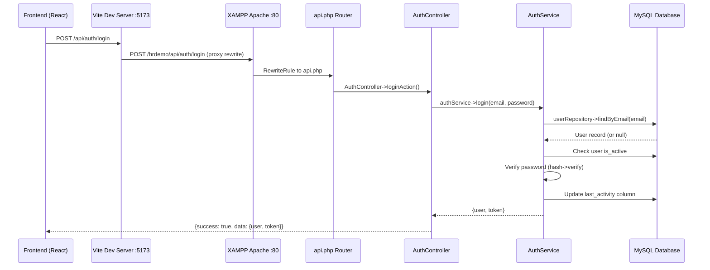
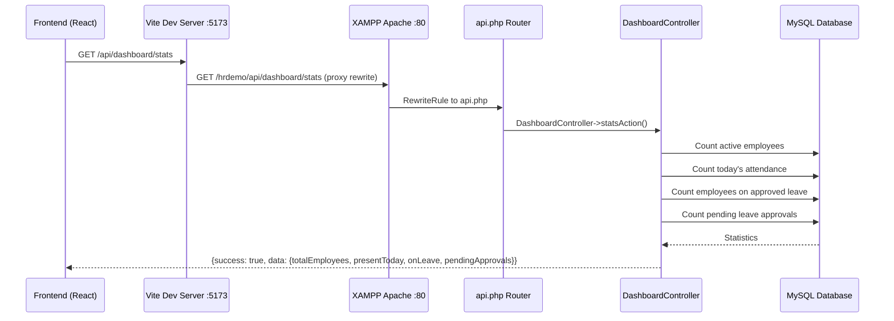
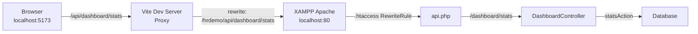
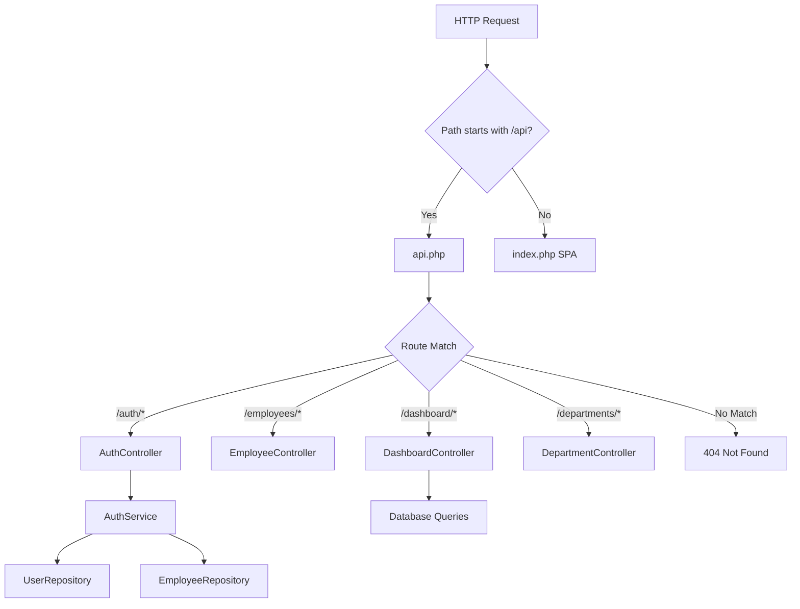

# API Documentation

## Base URL
```
http://localhost/hrdemo/api
```

## Authentication

All API endpoints require authentication via JWT token or session cookie.

### Headers
```
Authorization: Bearer {token}
Content-Type: application/json
Accept: application/json
```

---

## Authentication Flow Diagram



### Login Process (Fixed)

#### POST /auth/login
Login user and get JWT token.

**Request:**
```json
{
  "email": "user@example.com",
  "password": "password123"
}
```

**Response:**
```json
{
  "success": true,
  "message": "Login successful",
  "data": {
    "user": {
      "id": 1,
      "email": "user@example.com",
      "first_name": "John",
      "last_name": "Doe",
      "role": "admin"
    },
    "token": "eyJ0eXAiOiJKV1QiLCJhbGc..."
  }
}
```

**Error Responses:**
- `400` - Email and password are required
- `401` - Invalid credentials / User account is inactive
- `500` - Database connection failed or server error

**Bug Fix Applied:** The `updateLastLogin()` method in `AuthService` was updating a non-existent `last_login` column. It now correctly updates the `last_activity` column that exists in the `users` table schema.

#### POST /auth/logout
Logout user and invalidate token.

**Response:**
```json
{
  "success": true,
  "message": "Logout successful"
}
```

---

## Dashboard Flow Diagram



### Dashboard Endpoints (Fixed)

#### GET /api/dashboard/stats
Get dashboard statistics.

**Response:**
```json
{
  "success": true,
  "message": "Success",
  "data": {
    "totalEmployees": 150,
    "presentToday": 142,
    "onLeave": 5,
    "pendingApprovals": 12,
    "lateToday": 0
  }
}
```

**Bug Fixes Applied:**
1. Added missing dashboard routes in `api.php` - routes were not defined so requests fell through to the 404 handler
2. Fixed Vite proxy configuration in `frontend/vite.config.js`:
   - Changed target from `http://127.0.0.1:8000` to `http://localhost`
   - Added rewrite rule to prefix `/hrdemo` to proxied API paths
3. Fixed `statsAction()` in `DashboardController`:
   - Response format now matches frontend expectations (`totalEmployees`, `presentToday`, `onLeave`, `pendingApprovals`)
   - Uses correct `leave_applications` table instead of non-existent `leave_requests` table
   - Added try/catch error handling so database errors return defaults instead of 500

#### GET /api/dashboard/charts/attendance
Get attendance chart data.

**Response:**
```json
{
  "success": true,
  "data": {
    "records": [],
    "stats": {
      "total": 10,
      "clocked_in": 8,
      "clocked_out": 2,
      "late": 1
    }
  }
}
```

#### GET /api/dashboard/charts/departments
Get employee distribution by department.

**Response:**
```json
{
  "success": true,
  "data": {
    "total": 150,
    "by_department": [
      {
        "department": "IT",
        "count": 25
      }
    ]
  }
}
```

---

## Vite Proxy Configuration Diagram



### Vite Proxy Configuration (Fixed)

```js
// frontend/vite.config.js
proxy: {
  '/api': {
    target: 'http://localhost',       // XAMPP Apache
    changeOrigin: true,
    secure: false,
    rewrite: (path) => `/hrdemo${path}`,  // Prefix with /hrdemo
  },
},
```

---

## API Request Flow Diagram



---

## Endpoints

### Employees

#### GET /employees
Get all employees with pagination.

**Query Parameters:**
- `page` (optional): Page number (default: 1)
- `limit` (optional): Items per page (default: 30)
- `search` (optional): Search term
- `department_id` (optional): Filter by department
- `section_id` (optional): Filter by section
- `employee_status` (optional): Filter by status

**Response:**
```json
{
  "success": true,
  "data": {
    "data": [
      {
        "id": 1,
        "employee_id": "EMP001",
        "first_name": "John",
        "last_name": "Doe",
        "email": "john@example.com",
        "department_name": "IT",
        "section_name": "Development",
        "designation": "Software Engineer"
      }
    ],
    "total": 50,
    "page": 1,
    "limit": 30,
    "totalPages": 2
  }
}
```

#### GET /employees/{id}
Get single employee by ID.

**Response:**
```json
{
  "success": true,
  "data": {
    "id": 1,
    "employee_id": "EMP001",
    "first_name": "John",
    "last_name": "Doe",
    "email": "john@example.com",
    "phone": "+254700000000",
    "department_name": "IT",
    "section_name": "Development",
    "office_name": "Nairobi",
    "designation": "Software Engineer"
  }
}
```

#### POST /employees
Create new employee.

**Request:**
```json
{
  "employee_id": "EMP001",
  "first_name": "John",
  "last_name": "Doe",
  "email": "john@example.com",
  "phone": "+254700000000",
  "national_id": 12345678,
  "gender": "male",
  "department_id": 1,
  "section_id": 1,
  "office_id": 1,
  "designation": "Software Engineer"
}
```

**Response:**
```json
{
  "success": true,
  "message": "Employee created successfully",
  "data": {
    "id": 1
  }
}
```

#### PUT /employees/{id}
Update employee.

**Request:**
```json
{
  "first_name": "John Updated",
  "phone": "+254711111111"
}
```

#### DELETE /employees/{id}
Delete employee.

**Response:**
```json
{
  "success": true,
  "message": "Employee deleted successfully"
}
```

### Departments

#### GET /departments
Get all departments.

**Response:**
```json
{
  "success": true,
  "data": [
    {
      "id": 1,
      "name": "IT",
      "description": "Information Technology",
      "employee_count": 25
    }
  ]
}
```

#### POST /departments
Create department.

**Request:**
```json
{
  "name": "IT",
  "description": "Information Technology"
}
```

### Attendance

#### GET /attendance
Get attendance records.

**Query Parameters:**
- `page` (optional): Page number
- `limit` (optional): Items per page
- `date` (optional): Filter by date (YYYY-MM-DD)

**Response:**
```json
{
  "success": true,
  "data": {
    "data": [],
    "total": 0,
    "page": 1,
    "limit": 30,
    "totalPages": 0
  }
}
```

#### GET /attendance/today
Get today's attendance records.

#### GET /attendance/dashboard
Get attendance data for dashboard widgets.

#### GET /attendance/hr-dashboard
Organisation-wide attendance monitoring dashboard (HR/authorised users; requires `attendance.view`).
All statuses are computed server-side by `AttendanceDashboardService` — the single
source of truth for attendance status (the client never derives statuses).

**Status resolution priority:** HOLIDAY → NON_WORKING_DAY → ON_LEAVE → AUTO_CLOCKED_OUT → LATE → MISSING_CLOCK_OUT → PRESENT → CLOCKED_OUT → NOT_CLOCKED_IN* → ABSENT.
\* Under the approved business rule, an expected employee with no clock-in is **ABSENT immediately** (no grace period), so NOT_CLOCKED_IN does not occur unless the service's `NOT_CLOCKED_IN_GRACE_ENABLED` switch is flipped.

**Query Parameters:**
- `date` (optional): Date to view, YYYY-MM-DD (default: today)
- `department_id`, `section_id` (optional): scope summary + rows
- `status` (optional): row filter by status constant (e.g. ABSENT)
- `search` (optional): employee name / staff number
- `page`, `limit` (optional): pagination of the employee table
- `trend_days` (optional): trailing trend window 1–31 (default 7)

**Response:** `{ date, is_today, context, summary, employees[], pagination, departments[], trend[], absent_employees[], statuses[] }`

#### GET /attendance/hr-employee-history
Employee profile + recent attendance history for the dashboard detail modal
(requires `attendance.view`). Uses the live schema directly.

**Query Parameters:** `employee_id` (required), `start_date`, `end_date`, `limit`.

#### GET /attendance/employee/{employeeId}
Get attendance for a specific employee.

### Leave

#### GET /leave
Get leave records.

**Query Parameters:**
- `page` (optional): Page number
- `limit` (optional): Items per page
- `status` (optional): Filter by status (pending, approved, rejected, cancelled)

#### GET /leave/types
Get all leave types.

#### GET /leave/holidays
Get public holidays.

#### POST /leave/apply
Apply for leave.

**Request:**
```json
{
  "leave_type_id": 1,
  "start_date": "2024-02-01",
  "end_date": "2024-02-05",
  "reason": "Vacation"
}
```

#### PUT /leave/{leaveApplication}/approve
Approve leave application.

#### PUT /leave/{leaveApplication}/reject
Reject leave application.

#### PUT /leave/{leaveApplication}/cancel
Cancel leave application.

---

## Reports

#### GET /reports/employees
Get employees report.

#### GET /reports/leave
Get leave report.

#### GET /reports/attendance
Get attendance report.

#### GET /reports/{type}/export/{format}
Export report.

**Parameters:**
- `type`: employees, leave, attendance, or appraisal
- `format`: pdf, csv, or excel

---

## Audit Logs

The audit trail API provides a full dashboard with summary statistics, filterable
paginated logs, single-log detail views, and CSV export. All endpoints require
the `audit:view` permission (export requires `audit:export`).

### Endpoints

#### GET /api/audit
Get a paginated, searchable, filterable, sortable list of audit logs.

**Query Parameters:**
- `page` (optional): Page number (default: 1)
- `per_page` (optional): Items per page (default: 20, max: 100)
- `sort` (optional): Sort column — `created_at`, `action`, `module`, `user_name_snapshot`, `user_role_snapshot`, `status`, `ip_address`, `id` (default: `created_at`)
- `order` (optional): Sort direction — `ASC` or `DESC` (default: `DESC`)
- `action` (optional): Filter by action (e.g. `LOGIN`, `CREATE`, `UPDATE`, `DELETE`)
- `module` (optional): Filter by module (e.g. `Employees`, `Leave`, `Authentication`)
- `user_id` (optional): Filter by user ID
- `user_name_snapshot` (optional): Filter by user name
- `user_role_snapshot` (optional): Filter by user role
- `status` (optional): Filter by status — `SUCCESS` or `FAILED`
- `target_type` (optional): Filter by target type
- `target_id` (optional): Filter by target ID
- `date_from` (optional): Start date (YYYY-MM-DD)
- `date_to` (optional): End date (YYYY-MM-DD)
- `search` (optional): Full-text search across description, target_name, user_name_snapshot, and ip_address

**Response:**
```json
{
  "success": true,
  "message": "Audit logs retrieved successfully",
  "data": {
    "data": [
      {
        "id": 1,
        "user_id": 1,
        "user_name_snapshot": "John Doe",
        "user_role_snapshot": "admin",
        "action": "LOGIN",
        "module": "Authentication",
        "description": "User logged in successfully",
        "target_type": null,
        "target_id": null,
        "target_name": null,
        "ip_address": "192.168.1.100",
        "user_agent": "Mozilla/5.0 ...",
        "location": "Local network",
        "old_values": null,
        "new_values": null,
        "metadata": null,
        "status": "SUCCESS",
        "created_at": "2024-01-15 10:30:00"
      }
    ],
    "total": 150,
    "page": 1,
    "per_page": 20,
    "pages": 8
  }
}
```

#### GET /api/audit/statistics
Get summary statistics for the audit dashboard cards.

**Response:**
```json
{
  "success": true,
  "message": "Audit statistics retrieved successfully",
  "data": {
    "total_logs": 150,
    "success": 142,
    "failed": 8,
    "last_30_days": 45,
    "by_module": [
      { "module": "Employees", "count": 50 },
      { "module": "Leave", "count": 30 },
      { "module": "Authentication", "count": 25 }
    ]
  }
}
```

#### GET /api/audit/filters
Get distinct values for filter dropdowns (actions, modules, roles, status, users).

**Response:**
```json
{
  "success": true,
  "message": "Audit filter options retrieved successfully",
  "data": {
    "actions": ["LOGIN", "CREATE", "UPDATE", "DELETE"],
    "modules": ["Employees", "Leave", "Authentication", "Departments"],
    "roles": ["admin", "manager", "employee"],
    "status": ["SUCCESS", "FAILED"],
    "users": ["John Doe", "Jane Smith"]
  }
}
```

#### GET /api/audit/{id}
Get a single audit log by ID, with decoded JSON columns (`old_values`, `new_values`, `metadata`).

**Response:**
```json
{
  "success": true,
  "data": {
    "id": 1,
    "user_id": 1,
    "user_name_snapshot": "John Doe",
    "user_role_snapshot": "admin",
    "action": "UPDATE",
    "module": "Employees",
    "description": "Updated employee record",
    "target_type": "Employee",
    "target_id": 42,
    "target_name": "Jane Smith",
    "ip_address": "192.168.1.100",
    "user_agent": "Mozilla/5.0 ...",
    "location": "Local network",
    "old_values": { "first_name": "Jane", "last_name": "Smith" },
    "new_values": { "first_name": "Jane", "last_name": "Smith-Jones" },
    "metadata": { "source": "web" },
    "status": "SUCCESS",
    "created_at": "2024-01-15 10:30:00"
  }
}
```

#### GET /api/audit/export?format=csv
Export audit logs as CSV, honoring active filters. Requires `audit:export` permission.

**Query Parameters:**
- Same filter parameters as `GET /api/audit` (action, module, user_id, status, date_from, date_to, search)

**Response:** CSV file download with columns: ID, Timestamp, User, Role, Action, Module, Description, Target Type, Target ID, Target Name, IP Address, Location, Status.

#### GET /api/audit-logs (alias)
Alias for `GET /api/audit`. Returns the same paginated list.

---

## Error Responses

All errors follow this format:

```json
{
  "success": false,
  "message": "Error description",
  "error": "ERROR_CODE"
}
```

### HTTP Status Codes

- `200 OK` - Request successful
- `201 Created` - Resource created
- `400 Bad Request` - Invalid request data
- `401 Unauthorized` - Authentication required
- `403 Forbidden` - Insufficient permissions
- `404 Not Found` - Resource not found
- `500 Internal Server Error` - Server error

---

## Rate Limiting

API endpoints are rate limited to:
- 100 requests per minute per user
- 200 requests per minute per IP

Rate limit headers are included in responses:
```
X-RateLimit-Limit: 100
X-RateLimit-Remaining: 95
X-RateLimit-Reset: 1640000000
```

---

## Troubleshooting

### Dashboard returns 500 Internal Server Error

**Problem:** `GET /api/dashboard/stats` returns 500.

**Causes and fixes:**
1. **Missing route in `api.php`** - Ensure the dashboard routes are defined in the router:
   ```php
   elseif (strpos($endpoint, '/dashboard') === 0) {
       require_once __DIR__ . '/backend/app/Controllers/DashboardController.php';
       $controller = new \App\Controllers\DashboardController();
       if ($endpoint === '/dashboard/stats' && $requestMethod === 'GET') {
           $controller->statsAction();
       }
   }
   ```

2. **Wrong Vite proxy target** - Ensure `frontend/vite.config.js` proxies to the correct backend:
   ```js
   proxy: {
     '/api': {
       target: 'http://localhost',  // XAMPP runs on port 80
       rewrite: (path) => `/hrdemo${path}`,
     },
   },
   ```

3. **Database schema mismatch** - Ensure queries use the correct table names:
   - `leave_applications` (not `leave_requests`)
   - `attendance` with `attendance_date` and `clock_in` columns

### Login returns 500 Internal Server Error

**Problem:** `POST /api/auth/login` returns 500.

**Cause:** The `updateLastLogin()` method was referencing a `last_login` column that doesn't exist in the `users` table schema.

**Fix:** The method now updates the `last_activity` column:
```php
private function updateLastLogin(int $userId): void
{
    $this->userRepository->update($userId, [
        'last_activity' => date('Y-m-d H:i:s'),
    ]);
}